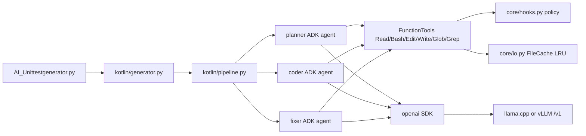

# UnitTest_gen Tool Overview

Pipeline for generating Kotlin/JUnit4 tests for Android Gradle modules, verifying with Gradle/Kover and optionally JaCoCo, and repairing only generated test code until acceptance tasks pass. It supports a local llama.cpp server and remote OpenAI-compatible vLLM.

---

## Stack at a glance

| Layer | Key path(s) | Responsibility |
|---|---|---|
| Model server | `UnitTest_gen/AgenticLLM/` | llama.cpp OpenAI-compatible server (`:8080/v1`), or remote vLLM |
| Agents | `UnitTest_gen/core/adk_agents/` | Google ADK planner / coder / fixer + openai SDK |
| CLI entrypoints | `UnitTest_gen/AI_Unittestgenerator.py`, `UnitTest_gen/multifile_orchestrater.py` | parse flags/env, pick targets, run pipeline |
| Core runtime | `UnitTest_gen/core/` | model resolve/health, tool policy, Gradle runner, file-cache LRU, diagnostics |
| Kotlin pipeline | `UnitTest_gen/kotlin/` | plan/coder orchestration, validation, coverage parsing, layer assignment |
| Data assets | `UnitTest_gen/data/` | recipes, prompt skeletons, validation rules, and prompt decision blocks |

---

## Quick start

### 1) Start the local OpenAI-compatible model

```bash
cd UnitTest_gen/AgenticLLM
cp .env.example .env   # set MODEL_PATH / MODEL_ALIAS
./scripts/setup.sh
./scripts/start-llama-server.sh
./scripts/health-check.sh --models
```

Port: **llama-server `8080`** (`/v1/chat/completions`).

Remote vLLM instead:

```bash
export TESTGEN_LLM_BACKEND=vllm
export TESTGEN_VLLM_BASE_URL=https://your-tunnel.example.com
export TESTGEN_VLLM_API_KEY=your-key
export TESTGEN_AGENT_MODEL=served-model-name
```

### 2) Install Python deps

```bash
pip install -r UnitTest_gen/requirements.txt
# google-adk + openai required for agents
```

### 3) Run the generator

```bash
python UnitTest_gen/AI_Unittestgenerator.py \
  -p path/to/Source.kt \
  -R /path/to/android/project
```

Notes:
- Auto-starts llama-server when `llm_backend=llama` unless disabled.
- `--agent-model` / `--agent-model-path` override `AgenticLLM/.env`.

Run all files through the multi-file orchestrator:

```bash
python UnitTest_gen/multifile_orchestrater.py -R /path/to/android/project
```

Use `--pipeline-phase plan` to write plans only, or `--pipeline-phase coder` to consume saved plans.

---

## Tool flow (high level)



---

## Key policies

- **Write/Edit:** `src/test`, `src/androidTest`, `build.gradle*`, `UnitTest_gen/`, and planner `*.plan.md` only — never `src/main`.
- **Bash:** any local command (`ls`/`cat`/`python3`/find/grep/`./gradlew`); network commands denied (curl/wget/pip/npm/ssh/scp, `git clone|fetch|pull|push`).
- **Denied tools:** WebSearch / WebFetch / NotebookEdit (omitted from ADK tool list).
- Prompt policy text lives in `data/prompt_skeletons/*_tool_block.md` and is still appended to agent prompts.

---

## Configuration (critical)

| Env / flag | Purpose |
|---|---|
| `TESTGEN_LLM_BACKEND` / `--llm-backend` | `llama` (default) or `vllm` |
| `TESTGEN_VLLM_BASE_URL` / `--vllm-base-url` | Remote OpenAI-compatible root |
| `TESTGEN_VLLM_API_KEY` / `--vllm-api-key` | Bearer key for remote |
| `TESTGEN_AGENT_MODEL` / `--agent-model` | Chat Completions model name |
| `TESTGEN_AGENT_MODEL_PATH` / `--agent-model-path` | Local GGUF path (llama only) |
| `TESTGEN_TEST_MODE` / `--test-mode` | `auto` (default), `unit`, or `instrumented`; `auto` enables both layers and selects the easier layer per source/item |
| `TESTGEN_PIPELINE_PHASE` / `--pipeline-phase` | `both` (default), `plan`, or `coder` |
| `TESTGEN_PLAN_ENABLE_THINKING` | Enable planner thinking; request value sent to either engine |
| `TESTGEN_GEN_ENABLE_THINKING` | Enable coder thinking |
| `TESTGEN_FIX_ENABLE_THINKING` | Enable fixer thinking |
| `TESTGEN_PLAN_THINKING_BUDGET` / `TESTGEN_GEN_THINKING_BUDGET` / `TESTGEN_FIX_THINKING_BUDGET` | Per-phase thinking budget |
| `TESTGEN_PLAN_PRESENCE_PENALTY` / `TESTGEN_GEN_PRESENCE_PENALTY` / `TESTGEN_FIX_PRESENCE_PENALTY` | Per-phase presence penalty |
| `TESTGEN_FILE_CACHE` | Process-local file LRU (default on) |
| `TESTGEN_GEN_TEMP` / `TESTGEN_PLAN_TEMP` / `TESTGEN_FIX_TEMP` | Per-phase temperature |
| `TESTGEN_KOVER_ACCEPTANCE` / `TESTGEN_JACOCO_ACCEPTANCE` | Enable the corresponding coverage gate |
| `TESTGEN_GRADLE_OFFLINE` | Run Gradle with offline dependency resolution |
| `TESTGEN_AUTO_START_EMULATOR` / `TESTGEN_AOSP_ROOT` / `TESTGEN_EMULATOR_LUNCH` | Instrumented-test emulator behavior |
| `TESTGEN_PROMPT_CACHE` | Prompt-cache backend setting (`off` by default) |
| `TESTGEN_SEMGREP_CACHE_DIR` | Semgrep cache location |

---

## Automatic test-layer selection

With `TESTGEN_TEST_MODE=auto`, Python assigns each source/item to the least-friction layer. Plain Kotlin logic, repositories, Room/Apollo code, and simple ViewModels use JVM unit tests. Hilt/Android-context/LiveData-heavy ViewModels, Hilt/navigation/UI fragments, workers, services, hardware, and system-service cases use `src/androidTest`.

The assignment is exclusive: the same planned lines are not intentionally generated in both layers. Recipe selection follows the same decision, including the complex Android ViewModel recipe at `data/recipes/complex_viewmodel_android.md`.

## Coverage and dashboard

Kover and JaCoCo are merged by covered-element union, so overlap counts once. Zero-hit JaCoCo reports do not add a missed denominator. Generate the HTML report with:

```bash
python UnitTest_gen/helper/dashboard.py -R /path/to/android/project
```

The dashboard shows overall union percentages in Module coverage and File coverage. See `core/gradle.py`, `kotlin/coverage.py`, and `helper/dashboard.py`.

## Repo outputs

- Pipeline logs: `UnitTest_gen/log/*.testgen.log`
- Plans: `UnitTest_gen/data/plans/`
- Generated tests: module `src/test` / `src/androidTest`
- Dashboard: `UnitTest_gen/data/htmlreport/diagnostics.html`
- Coverage model: `UnitTest_gen/data/diagnostics.json`
- Deferred coverage: `UnitTest_gen/data/unreachable_coverage.json` when configured
- Recipes: `UnitTest_gen/data/recipes/` and API catalogs under `UnitTest_gen/data/api_doc/`
